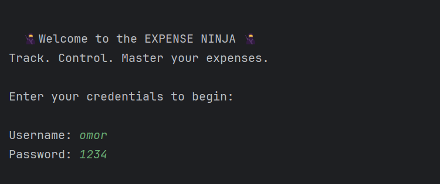
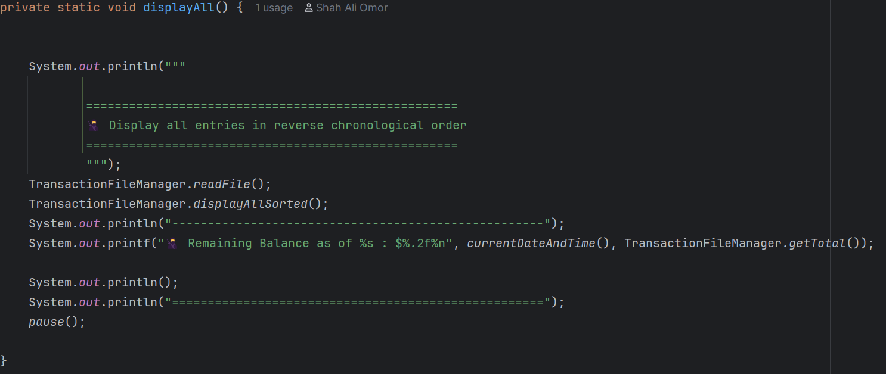
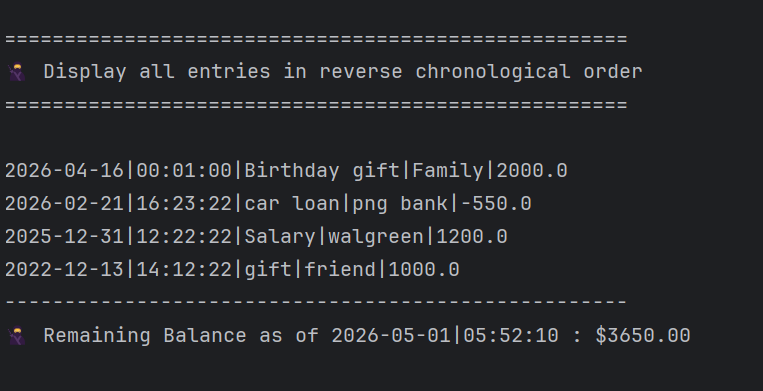

# 🥷 Expense Ninja App

## Description
Expense Ninja is a Java command-line (CLI) application designed to help users manage financial transactions such as deposits and payments.  
The application includes a login system, transaction tracking, and reporting features.

This project demonstrates core Java concepts including file handling, loops, conditional logic, and object-oriented programming (OOP).

---

## Running the Code
The easiest way to run the application is:

1. Open the project in IntelliJ IDEA
2. Navigate to:
   `AccountingLedgerApp.java`
3. Click the Run ▶️ button or press **Shift + F10**

---
## 🔐 Login Credentials (Demo)
This application includes a basic login system.

- Username: omor
- Password: 1234

---

## Features
- 🔐 Login system with 3 attempts
- 💰 Add Deposit
- 💸 Make Payment
- 📊 View Ledger (All, Deposits, Payments,Reports, Home)
- 📅 Reports (MTD, Previous month, YTD, Previous Year, Search by vendor, Custom Search)
- 🔄 Transactions sorted in reverse chronological order
- 🧮 Automatic balance calculation
---

## Code I'm Most Proud Of
I'm most proud of the part of the code that displays transactions with the exact date, time, and total balance.  
It combines formatting, real-time data, and calculation to give a clear summary to the user.

For example:

## My Personal Challenges
One of the main challenges I faced was working with file handling and making sure transactions were correctly saved and read from the CSV file. Sometimes formatting issues caused errors, which required careful debugging.

Another challenge was handling user input safely. I had to prevent crashes when users entered invalid data by using validation methods and managing input properly.

Overall, these challenges helped me improve my debugging skills and build a more reliable application.

## What I'd Do If I Had More Time
If I had more time, I would improve the login system by adding better admin control and password security, possibly through a graphical user interface (GUI).

I would also add more features to enhance usability, such as allowing users to choose between entering a custom date and time or using the current system date and time when adding deposits or payments.

Additionally, I would expand the application by adding more options and improving the overall user experience.

## Next Time...
Next time, I would spend more time planning the structure of the application before starting to code. This would help reduce errors and make the development process smoother.

I would also break the project into smaller steps and test each part more carefully to avoid bugs.

Overall, I would focus on better organization and planning to improve efficiency and code quality.